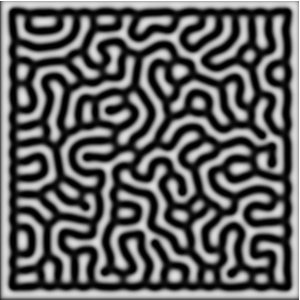
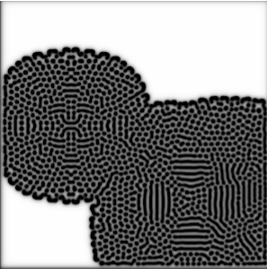

# Reaction Diffusion 
An implementation of the Gray-Scott reaction-diffusion model detailed [here](https://karlsims.com/rd.html).

## Description
Learning Go with a simple implementation and display of reaction diffusion systems. The interface is made using the [fyne](https://developer.fyne.io/started/) package. The parameters can be tweaked with sliders during the simulation. A screenshot can be generated by pressing `s`.

## Run
`go run simulation.go`  
Press `c` to close the window, or ctrl+C in terminal.  

## Examples

